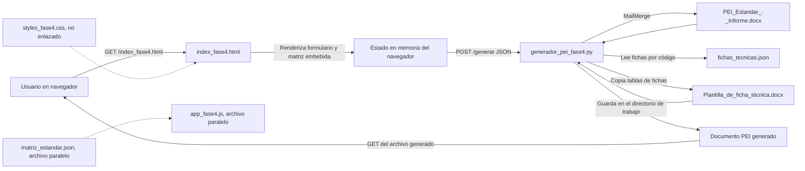

# PEI-CEPLAN

Generador local de documentos del **Plan Estratégico Institucional (PEI)** para gobiernos locales. El sistema permite completar los datos generales del municipio, seleccionar y priorizar objetivos y acciones estratégicas, registrar metas anuales y producir un documento `.docx` a partir de plantillas Word y datos JSON.

Este README describe el estado comprobado en el código actual. No representa una arquitectura futura ni afirma que los archivos paralelos del repositorio estén conectados al flujo vigente.

## Alcance actual

El flujo implementado cubre cuatro pasos en el navegador:

1. Captura de datos generales y documentos de referencia del municipio.
2. Selección de OEI, indicadores OEI, AEI e indicadores AEI, además de la priorización mediante arrastrar y soltar.
3. Registro del año base, valor base y metas por año para los indicadores seleccionados.
4. Envío de un payload JSON al servidor y descarga del documento Word generado.

El servidor es un proceso Python local basado en `HTTPServer` y `SimpleHTTPRequestHandler`. No hay base de datos, autenticación, API separada, sistema de usuarios ni pruebas automatizadas en los archivos versionados actuales.

## Arquitectura

El flujo activo es monolítico y local: el mismo proceso sirve los archivos estáticos y atiende la generación del documento.



### Flujo activo y archivos paralelos

El `index_fase4.html` actual contiene su propio CSS y JavaScript dentro del mismo archivo. No contiene una etiqueta `<script src="app_fase4.js">`, no enlaza `styles_fase4.css` y construye la interfaz desde la constante `MATRIZ_ESTANDAR` embebida. Por tanto:

| Archivo | Situación en el flujo actual |
|---|---|
| `index_fase4.html` | Frontend activo: formulario, estado, validaciones, payload y llamada a `/generar`. |
| `generador_pei_fase4.py` | Servidor HTTP y generador DOCX activo. |
| `app_fase4.js` | Implementación JavaScript paralela que sí intenta cargar `matriz_estandar.json`, pero no es referenciada por `index_fase4.html`. |
| `styles_fase4.css` | Hoja de estilos paralela; el HTML actual usa estilos embebidos y no la enlaza. |
| `matriz_estandar.json` | Matriz externa consumida por `app_fase4.js`; el generador Python no la lee y el frontend activo usa la copia embebida. |

Esta duplicación es una deuda de mantenimiento: modificar solo `matriz_estandar.json`, `app_fase4.js` o `styles_fase4.css` no cambia necesariamente la interfaz que se abre desde `index_fase4.html`.

## Responsabilidades por componente

### `index_fase4.html`

- Define la pantalla de cuatro pasos: datos generales, selección/priorización, metas y generación.
- Contiene los campos básicos con estos identificadores: `codigo_ue`, `nombre_municipio`, `periodo_pei`, `nombre_provincia`, `nombre_region`, `nombre_alcalde`, `resolucion_alcaldia`, `plan_desarrollo_concertado`, `ordenanza_pdc`, `mision_institucional`, `politica_general_gobierno` y `decreto_politica_general_gobierno`.
- Embebe la constante `MATRIZ_ESTANDAR`, que alimenta la lista de OEI, AEI e indicadores del flujo activo.
- Genera identificadores de selección como `oei-OEI.01`, `ind-oei-OEI.01-0`, `aei-AEI.01.01` e `ind-aei-AEI.01.01-0`.
- Valida en el navegador que existan datos básicos, al menos un OEI, indicadores OEI, AEI y valores de metas antes de avanzar.
- Construye el payload y ejecuta `fetch('/generar', { method: 'POST', headers: { 'Content-Type': 'application/json' } })`.
- Muestra el nombre devuelto en `result.file` y crea un enlace de descarga hacia el archivo servido por el mismo proceso.

El estado del frontend activo se mantiene en memoria en `appState`. No se observa uso de `localStorage` en el código embebido de `index_fase4.html`; al recargar la página, los datos introducidos se pierden.

### `generador_pei_fase4.py`

- Arranca un `HTTPServer` en el puerto `8000` con `PEIHandler`.
- Hereda de `SimpleHTTPRequestHandler`, por lo que también sirve archivos estáticos desde el directorio de trabajo.
- Acepta `POST /generar`, decodifica el cuerpo como UTF-8 y lo interpreta con `json.loads`.
- Importa `docx-mailmerge` y `python-docx`. Si no están disponibles, intenta instalarlos mediante `pip` durante la ejecución.
- Ejecuta la generación en tres etapas visibles en el código: MailMerge de datos generales, filtrado de tablas y metas, y anexado de fichas técnicas.
- Devuelve el nombre del documento generado y conserva el archivo en el directorio desde el que se ejecutó el servidor.

### `app_fase4.js`

Es una implementación alternativa o anterior del frontend. Tiene lógica para cargar `matriz_estandar.json`, guardar datos en `localStorage` bajo la clave `peiFormData`, restaurarlos y enviar el contenido a `/generar`. El HTML actual no la carga, por lo que sus diferencias no deben interpretarse automáticamente como comportamiento del flujo activo.

### `styles_fase4.css`

Contiene estilos para una interfaz equivalente: pasos, selección, prioridades, metas, mensajes y diseño responsive. No se enlaza desde `index_fase4.html`; actualmente funciona como archivo de estilos separado no utilizado por esa página.

## Flujo de generación end-to-end

1. El usuario ejecuta `generador_pei_fase4.py` desde la raíz del repositorio.
2. El servidor escucha en `http://localhost:8000` y sirve `index_fase4.html` como archivo estático.
3. El HTML renderiza la matriz embebida y permite capturar los datos generales del PEI.
4. El usuario selecciona OEI, indicadores OEI, AEI e indicadores AEI. Cada selección se representa mediante los identificadores generados en el DOM.
5. El usuario reordena los OEI y, si abre su lista correspondiente, las AEI. El orden se serializa como códigos sin los prefijos `oei-` y `aei-`.
6. El frontend crea un formulario de metas por indicador seleccionado. Los años se obtienen de los dos años de cuatro dígitos encontrados en `periodo_pei`; si no se encuentran, usa `2026` a `2030`.
7. Al pulsar **Generar Documento Word**, el navegador envía el payload JSON a `POST /generar`.
8. Python aplica los campos generales a `PEI_Estandar_-_Informe.docx` mediante MailMerge y escribe temporalmente `_temp1.docx`.
9. Python abre el temporal con `python-docx`, filtra las filas de las tablas según los códigos seleccionados y completa la tabla cuyo encabezado contiene `Logros Esperados`.
10. Python carga `fichas_tecnicas.json`, copia la primera tabla de `Plantilla_de_ficha_técnica.docx` por cada código de la jerarquía seleccionada y rellena sus celdas con los datos de la ficha.
11. El resultado se guarda como `PEI_<nombre_municipio>.docx`, reemplazando espacios del nombre del municipio por `_`; si el nombre está vacío, usa `PEI_Doc.docx`.
12. El servidor devuelve un JSON de éxito y el navegador ofrece el archivo mediante una segunda solicitud HTTP al nombre retornado.

## Contratos HTTP y datos

### Rutas observadas

| Método y ruta | Comportamiento comprobado |
|---|---|
| `GET` de archivos estáticos | Lo atiende la implementación heredada de `SimpleHTTPRequestHandler` desde el directorio de trabajo. |
| `POST /generar` | Lee JSON, genera el DOCX y responde con JSON. |
| Cualquier otra ruta `POST` | Responde con error HTTP `404`. |

No hay rutas de salud, consulta de datos, autenticación, edición de plantillas ni eliminación de archivos definidas explícitamente.

### Payload enviado por el frontend activo

El siguiente ejemplo usa únicamente nombres de campos y formatos que aparecen en `index_fase4.html` y `generador_pei_fase4.py`:

```json
{
  "codigo_ue": "001234",
  "nombre_municipio": "Municipalidad Provincial de Lima",
  "periodo_pei": "2026-2030",
  "nombre_provincia": "Lima",
  "nombre_region": "Lima",
  "nombre_alcalde": "Nombre del alcalde",
  "resolucion_alcaldia": "Resolución de Alcaldía N° 001-2024-MDL",
  "plan_desarrollo_concertado": "Plan de Desarrollo Concertado 2024-2030",
  "ordenanza_pdc": "Ordenanza Municipal N° 002-2024-MDL",
  "mision_institucional": "Misión institucional del municipio",
  "politica_general_gobierno": "Política General de Gobierno al 2026",
  "decreto_politica_general_gobierno": "Decreto Supremo N° 164-2023-PCM",
  "selecciones": {
    "oei": ["oei-OEI.01"],
    "indicadoresOEI": ["ind-oei-OEI.01-0"],
    "aei": ["aei-AEI.01.01"],
    "indicadoresAEI": ["ind-aei-AEI.01.01-0"]
  },
  "prioridades": {
    "oei": ["OEI.01"],
    "aei": {
      "OEI.01": ["AEI.01.01"]
    }
  },
  "metas": {
    "ind-oei-OEI.01-0": {
      "año_base": 2024,
      "valor_base": 38,
      "meta_2026": 45,
      "meta_2027": 49,
      "meta_2028": 52,
      "meta_2029": 56,
      "meta_2030": 60
    },
    "ind-aei-AEI.01.01-0": {
      "año_base": 2024,
      "valor_base": 2,
      "meta_2026": 3,
      "meta_2027": 4,
      "meta_2028": 5,
      "meta_2029": 6,
      "meta_2030": 7
    }
  }
}
```

Detalles relevantes del contrato:

- `selecciones.oei` y `selecciones.aei` contienen IDs del DOM con prefijos; Python los elimina antes de comparar códigos.
- `selecciones.indicadoresOEI` y `selecciones.indicadoresAEI` contienen IDs con un índice numérico iniciado en `0`.
- `prioridades.oei` contiene códigos OEI en el orden de los elementos `.priority-item`.
- `prioridades.aei` es un objeto cuyo índice es el código OEI y cuyo valor es una lista de códigos AEI. El frontend activo solo agrega una lista AEI cuando existe el contenedor ordenable correspondiente.
- `metas` se indexa por ID de indicador y utiliza `año_base`, `valor_base` y campos `meta_YYYY`. Los valores numéricos se construyen con `parseFloat` en el frontend activo.
- El backend lee los doce campos generales mediante `data.get(...)`; si faltan, los convierte en cadenas vacías en lugar de rechazar el payload.

### Respuestas observadas

En caso de éxito, `POST /generar` responde HTTP `200` con una forma equivalente a:

```json
{
  "success": true,
  "file": "PEI_Municipalidad_Provincial_de_Lima.docx",
  "message": "Generado"
}
```

Si ocurre una excepción, responde HTTP `500` con:

```json
{
  "success": false,
  "error": "Detalle de la excepción"
}
```

No hay un esquema formal ni validación de tipos en el servidor. Un payload incompleto puede llegar a la etapa de generación y producir un documento vacío o parcialmente completado sin devolver un `4xx` específico.

## Datos y plantillas

### `matriz_estandar.json`

Tiene una raíz `oei` con objetos que contienen `codigo`, `denominacion`, `indicadores` y `aei`. Cada indicador tiene `nombre` y `unidad`; cada AEI contiene `codigo`, `denominacion` e `indicadores`.

La versión externa contiene actualmente 11 OEI, 53 AEI, 16 indicadores OEI y 66 indicadores AEI. Es consumida por `app_fase4.js`, pero el frontend que se abre desde `index_fase4.html` utiliza una copia embebida llamada `MATRIZ_ESTANDAR`. El backend Python no lee este archivo.

### `fichas_tecnicas.json`

Es un objeto indexado por código OEI o AEI. Actualmente contiene 64 códigos y 492 registros distribuidos en listas:

| Registros por código | Cantidad de códigos |
|---:|---:|
| 6 | 54 |
| 12 | 4 |
| 18 | 5 |
| 30 | 1 |

Los registros incluyen, entre otros, `codigo`, `objetivo_accion`, `nombre_indicador`, `justificacion`, `responsables`, `limitaciones`, `metodo_calculo`, `sentido_esperado`, `proceso_recoleccion`, `fuente_datos`, `linea_base`, `anio_base`, `valor_relativo`, `valor_absoluto` y `nota`.

El generador usa `fichas_db[codigo][0]`. Por ello, aunque el JSON conserva múltiples registros por código y por año/indicador, el flujo actual toma solo el primer registro de cada código al crear el anexo.

### `PEI_Estandar_-_Informe.docx`

Es la plantilla principal del informe. La inspección del archivo muestra siete tablas:

| Tabla observada | Papel en la generación |
|---:|---|
| 0 | Tabla de OEI con código, enunciado y nombre del indicador. |
| 1 | Tabla adicional de OEI/AEI e indicadores. |
| 2 | Ruta estratégica con prioridades OEI/AEI, vinculaciones y unidad responsable. |
| 3 | Relación entre objetivos/acciones estratégicas regionales, provinciales o distritales y OEI/AEI. |
| 4 | Vinculación con políticas nacionales, lineamientos, servicios, AEI e indicadores. |
| 5 | Datos administrativos, incluyendo campos MailMerge como `Codigo_UE`, `Nombre_Municipio` y `Periodo_PEI`. |
| 6 | Tabla `Logros Esperados`, donde se escriben año base, valor base y metas anuales. |

El backend no identifica estas tablas por un esquema externo: detecta códigos mediante expresiones regulares y decide si una tabla es simple, combinada, la matriz B-3 o la tabla de logros esperados según su contenido y posición de columnas.

### `Plantilla_de_ficha_técnica.docx`

Es una plantilla independiente con una tabla de 15 filas titulada `FICHA TÉCNICA DEL INDICADOR`. El generador copia la tabla completa mediante `deepcopy` por cada código seleccionado y rellena las filas 1 a 9 y 11 a 13 en la columna 1 con campos de `fichas_tecnicas.json`.

La relación entre filas, columnas y campos está codificada directamente en `generador_pei_fase4.py`; cambiar el orden o la cantidad de filas de esta plantilla requiere revisar esa función.

## Estructura del repositorio

| Ruta | Responsabilidad |
|---|---|
| `README.md` | Documentación del sistema y de su estado verificable. |
| `generador_pei_fase4.py` | Servidor local, filtrado de tablas y generación de DOCX. |
| `index_fase4.html` | Frontend activo autocontenido, con CSS y JavaScript embebidos. |
| `app_fase4.js` | Frontend JavaScript paralelo, no referenciado por el HTML actual. |
| `styles_fase4.css` | Estilos CSS paralelos, no enlazados por el HTML actual. |
| `matriz_estandar.json` | Matriz OEI/AEI externa para `app_fase4.js`. |
| `fichas_tecnicas.json` | Registros de fichas técnicas indexados por código. |
| `PEI_Estandar_-_Informe.docx` | Plantilla principal del informe PEI. |
| `Plantilla_de_ficha_técnica.docx` | Plantilla de la tabla de ficha técnica anexada al informe. |

No hay `requirements.txt`, `pyproject.toml`, `package.json`, directorio de pruebas ni configuración de base de datos versionados en el repositorio actual.

## Ejecución local

### Requisitos observados

- Un intérprete Python 3; el script declara `#!/usr/bin/env python3`.
- Acceso de escritura al directorio del repositorio para `_temp1.docx` y el documento de salida.
- Las bibliotecas Python `docx-mailmerge` y `python-docx`. El script intenta instalarlas con `pip` si el import falla, utilizando `--break-system-packages`; también es posible que esa instalación automática falle por permisos, red o políticas del entorno.
- Un navegador que pueda acceder a `localhost:8000`.

### Pasos

Ejecutar desde el directorio que contiene las plantillas y los JSON:

```bash
cd /home/akidev/proyects/PEI-CEPLAN/PEI-CEPLAN
python generador_pei_fase4.py
```

El servidor imprime la URL base `http://localhost:8000`, pero el archivo de entrada se llama `index_fase4.html` y no existe un `index.html`. Abrir explícitamente:

```text
http://localhost:8000/index_fase4.html
```

El directorio de trabajo es parte del contrato operativo: el generador abre `PEI_Estandar_-_Informe.docx`, `Plantilla_de_ficha_técnica.docx` y `fichas_tecnicas.json` mediante rutas relativas. Ejecutarlo desde otra carpeta puede causar errores de archivo no encontrado o servir contenido estático distinto.

Para detener el proceso, interrumpir el servidor con `Ctrl+C`; el código captura `KeyboardInterrupt` y muestra un mensaje de detención.

## Operación y mantenimiento

| Cambio | Archivos que deben revisarse |
|---|---|
| Agregar, eliminar o renombrar un campo del formulario activo | `index_fase4.html` para el control y `construirPayload`; `generador_pei_fase4.py` para `campos` y `merge_data`; `PEI_Estandar_-_Informe.docx` para el campo MailMerge correspondiente. |
| Cambiar OEI, AEI o indicadores del flujo activo | La constante `MATRIZ_ESTANDAR` dentro de `index_fase4.html`; revisar también `matriz_estandar.json` si se mantiene `app_fase4.js`. |
| Cambiar fichas técnicas | `fichas_tecnicas.json`; conservar las claves de código y los nombres de campo que lee `generador_pei_fase4.py`. |
| Cambiar el informe, sus tablas o sus marcadores | `PEI_Estandar_-_Informe.docx` y la lógica de detección/filtrado de tablas en `generador_pei_fase4.py`. |
| Cambiar la estructura de una ficha técnica | `Plantilla_de_ficha_técnica.docx` y las posiciones usadas por `stxt` en `generador_pei_fase4.py`. |
| Cambiar el frontend activo | El JavaScript y CSS embebidos en `index_fase4.html`; no asumir que `app_fase4.js` o `styles_fase4.css` se ejecutan. |
| Cambiar el puerto o la URL local | `HTTPServer(('', 8000), PEIHandler)`, el mensaje de inicio y los textos de ayuda del HTML. |

Después de cada cambio de plantilla o JSON conviene realizar una generación manual completa y revisar el DOCX, porque no existe una suite automatizada que compruebe el contenido final.

## Limitaciones, riesgos y deuda visible

Estas observaciones describen el código actual; no son funcionalidades disponibles ni recomendaciones ya implementadas.

- **Validación insuficiente en backend:** el servidor no valida un esquema, tipos, campos obligatorios ni consistencia entre selecciones, indicadores y metas. Los controles de obligatoriedad están principalmente en el navegador.
- **Exposición de archivos:** `SimpleHTTPRequestHandler` sirve el directorio de trabajo y el servidor se crea con `('', 8000)`, por lo que escucha en todas las interfaces disponibles, no solo en `localhost`. No hay autenticación ni autorización.
- **Instalación dinámica:** una generación puede ejecutar `pip install docx-mailmerge python-docx --break-system-packages`; no hay versiones fijadas ni archivo de dependencias.
- **Duplicación del frontend y de la matriz:** el flujo activo mantiene una matriz embebida distinta de `matriz_estandar.json`, mientras que `app_fase4.js` y `styles_fase4.css` no están enlazados. Esto permite que la interfaz, los datos externos y la documentación se desincronicen.
- **Orden AEI no aplicado por el backend:** el frontend envía `prioridades.aei`, pero `generador_pei_fase4.py` no lo usa para construir `codigos_ordenados`; ordena las AEI por código mediante `sort()`.
- **Selección de la primera ficha:** para cada código, el backend usa solo `fichas_db[codigo][0]`, aunque existen múltiples entradas por código.
- **Metas agrupadas solo por código:** las metas se agrupan por código y la tabla de `Logros Esperados` usa el primer elemento de cada grupo (`metas_por_codigo[codigo][0]`). Para códigos con varios indicadores, esto puede escribir la meta de un indicador en otra fila.
- **Nombre de salida sin sanitización completa:** el nombre del municipio solo reemplaza espacios por `_`; otros caracteres pueden afectar el nombre o la ruta del archivo.
- **Intermedios y saltos de página:** el proceso usa `_temp1.docx` y agrega saltos de página explícitos al anexar fichas. Una excepción antes de la limpieza puede dejar el temporal y cambios de plantilla pueden producir paginación inesperada.
- **Sin pruebas automatizadas:** no existe directorio de pruebas versionado y no hay una suite automatizada que cubra la generación.
- **Errores poco estructurados:** las excepciones se imprimen en la terminal y se devuelven como texto en `error`; no hay clasificación de errores de entrada, de plantilla o de dependencias.

## Depuración rápida

| Síntoma | Comprobaciones concretas |
|---|---|
| La página no carga | Confirmar que el proceso sigue activo, que se ejecutó desde `/home/akidev/proyects/PEI-CEPLAN/PEI-CEPLAN` y que se abrió `http://localhost:8000/index_fase4.html`. La raíz `http://localhost:8000` puede mostrar el listado del directorio porque no existe `index.html`. Revisar si el puerto `8000` ya está ocupado. |
| Falta una plantilla o un JSON | Revisar el directorio actual del proceso y la existencia exacta de `PEI_Estandar_-_Informe.docx`, `Plantilla_de_ficha_técnica.docx` y `fichas_tecnicas.json`; el backend usa nombres relativos y sensibles a la ruta. |
| El navegador muestra error al generar | Revisar la pestaña Network para confirmar `POST /generar`, el estado HTTP y el cuerpo JSON. Después revisar la terminal: el servidor imprime la excepción y su traceback. |
| La respuesta no es JSON | Confirmar que la solicitud llega a `generador_pei_fase4.py` y que no se está abriendo el HTML con `file://`; el frontend espera una respuesta JSON de `/generar`. |
| Se genera un documento vacío o incompleto | Verificar que el payload contiene las cuatro listas de `selecciones`, las metas por ID de indicador y los doce campos generales. Revisar además que los códigos existan en la plantilla y en `fichas_tecnicas.json`. |
| El documento contiene datos de otra ficha o meta | Revisar la primera entrada de `fichas_tecnicas.json` para el código y comprobar si el código tiene varios indicadores; el backend actualmente toma el primer registro/meta por código. |
| No se puede descargar el resultado | Tomar el valor exacto de `file` en la respuesta y comprobar que el documento exista en el mismo directorio del servidor. El enlace de descarga depende de la misma ruta estática. |
| Cambios en `matriz_estandar.json` no aparecen | Recordar que el HTML actual usa `MATRIZ_ESTANDAR` embebida. `matriz_estandar.json` solo participa a través del `app_fase4.js` no enlazado. |

## Estado y documentación viva

### Verificado en el código actual

- Nombre de los archivos principales y de las dos plantillas DOCX.
- Puerto `8000`, URL local mostrada por el servidor y ruta `POST /generar`.
- Campos generales, estructura de `selecciones`, `prioridades` y `metas` construida por el frontend activo.
- Formato de respuestas JSON de éxito y error.
- Nombre y ubicación relativa del documento de salida.
- Uso de MailMerge, filtrado de tablas, tabla `Logros Esperados` y copia de fichas técnicas.
- Estructura y conteos actuales de `matriz_estandar.json` y `fichas_tecnicas.json`.
- Ausencia de manifiesto de dependencias y pruebas versionadas.

### Actualizar cuando cambie el sistema

Revisar esta documentación si cambia cualquiera de estos contratos: campos o IDs del HTML, constante `MATRIZ_ESTANDAR`, uso de `app_fase4.js`, hoja de estilos enlazada, puerto o rutas HTTP, nombres de plantillas, posiciones de filas/columnas DOCX, claves de los JSON, selección de fichas/metas o mecanismo de instalación de dependencias.

La fuente de verdad técnica sigue siendo el código ejecutable y las plantillas del repositorio. Si este README contradice esos archivos, debe corregirse el README o señalarse explícitamente la discrepancia antes de usarlo como guía de mantenimiento.
